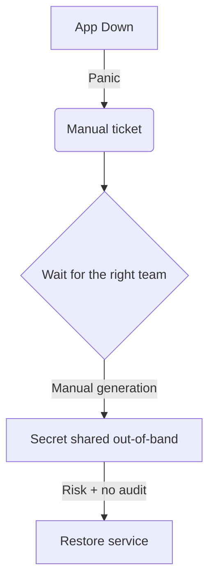

# The incident pattern we inherited

### What actually breaks
- Critical apps go down with no warning
- Logs show: "client secret expired"
- Escalations, manual firefighting, long MTTR
- **Security debt**: secrets shared out-of-band, weak audit trail

---
layout: default
class: text-sm
---

# The legacy detection approach

- Someone runs scripts "every now and then" to discover what is expiring...
-   ❌ Reactive, slow, and brittle
-   ❌ No context or audit trail for operations
-   ❌❌❌❌ I'm the one manually doing it, each month, through manually created tickets ❌❌❌❌

  

