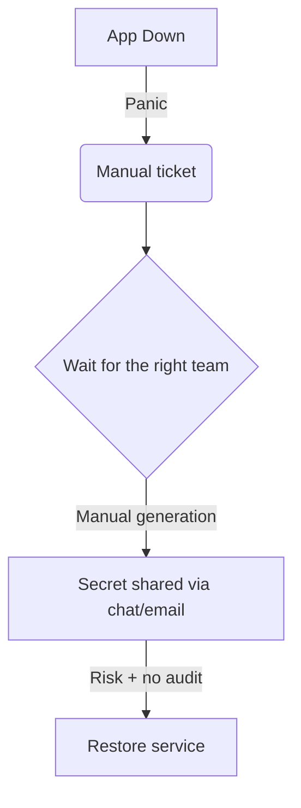

# The incident pattern we inherited

## What actually breaks
- Critical apps go down with no warning
- Logs show: "client secret expired"
- Escalations, manual firefighting, long MTTR
- This stems from good intentions: "secrets should expire every 6 months" 
- **Security debt**: secrets shared via chat or email, no audit trail

::right::

---
layout: default
---

# The legacy detection approach

- Someone runs scripts "every now and then" to discover what is expiring...
-   ❌ Reactive, slow, and brittle
-   ❌ No context or audit trail for operations
-   ❌❌❌❌ I'm the one manually doing it, each month, through manually created tickets ❌❌❌❌

  

