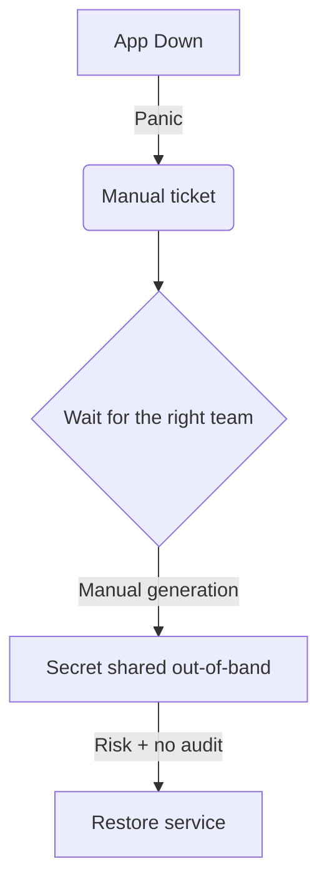

# The incident pattern we inherited

### What actually breaks
- Critical apps go down with no warning
- Logs show: "client secret expired"
- Escalations, manual firefighting, long MTTR
- **Security debt**: secrets shared out-of-band, weak audit trail

---
layout: default
class: text-sm
---

# The legacy detection approach

Someone runs scripts "every now and then" to discover what is expiring...

TODO insert image meme here

  ❌ Reactive, slow, and brittle

