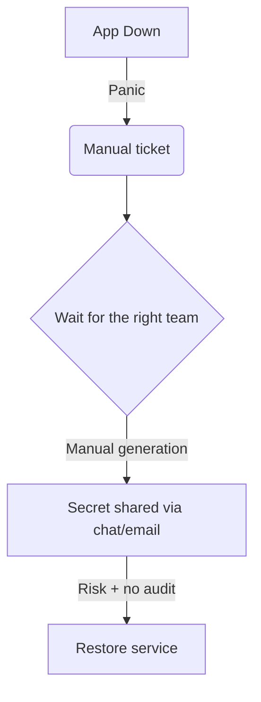
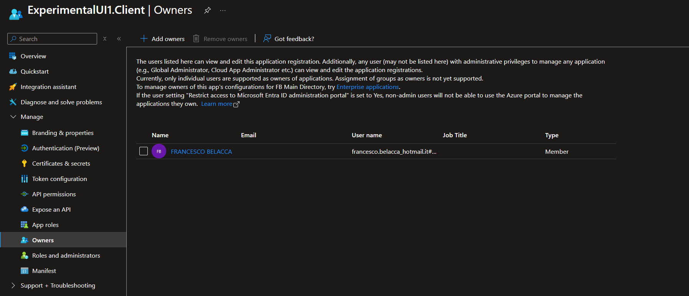

# The incident pattern we inherited

## What actually breaks
- Critical apps go down with no warning
- Logs show: "client secret expired"
- Escalations, manual firefighting, long MTTR
- This stems from good intentions: "secrets should expire every 6 months" 
- **Security debt**: secrets shared via chat or email, no audit trail

::right::

---
layout: default
---

# We gained trust from our global GA Team

- We could not create secrets autonomously
- But in our tenant user consent is disabled
- Application Developer role exists
- We could not assign permissions for keyvaults that we owned --> custom role

  

---
layout: default
---

# The legacy detection approach

- Once we got permissions to create secrets (Owners)
- Someone runs scripts "every now and then" to discover what is expiring...
- ❌ Still manual, slow, and brittle
- ❌ No context or audit trail for operations
- ❌❌❌❌ I'm the one manually doing it, each month ❌❌❌❌

  

