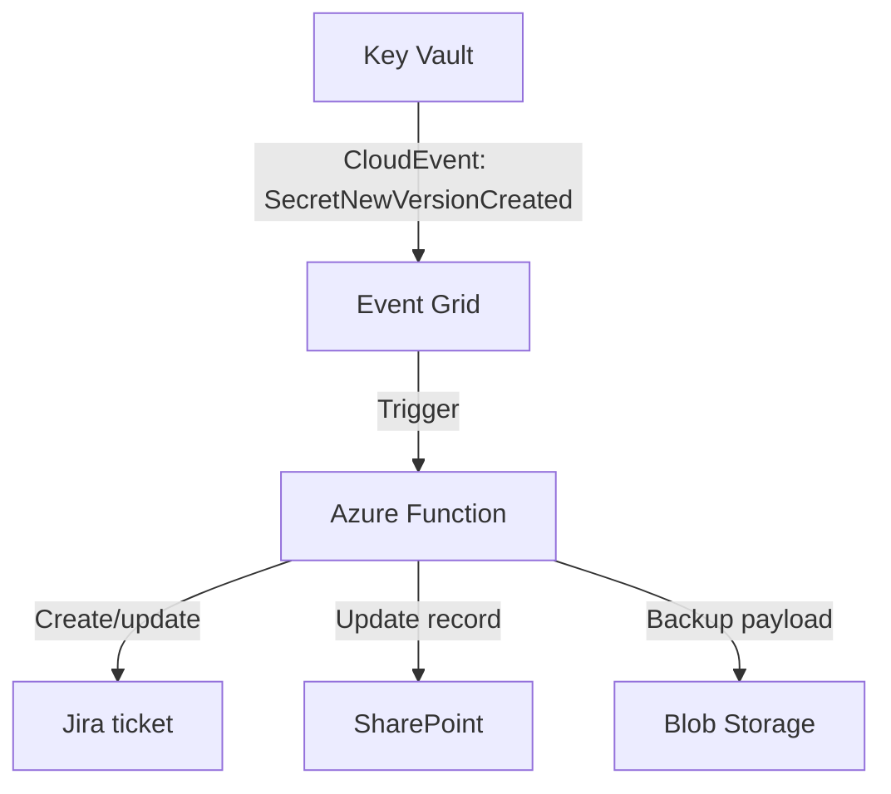
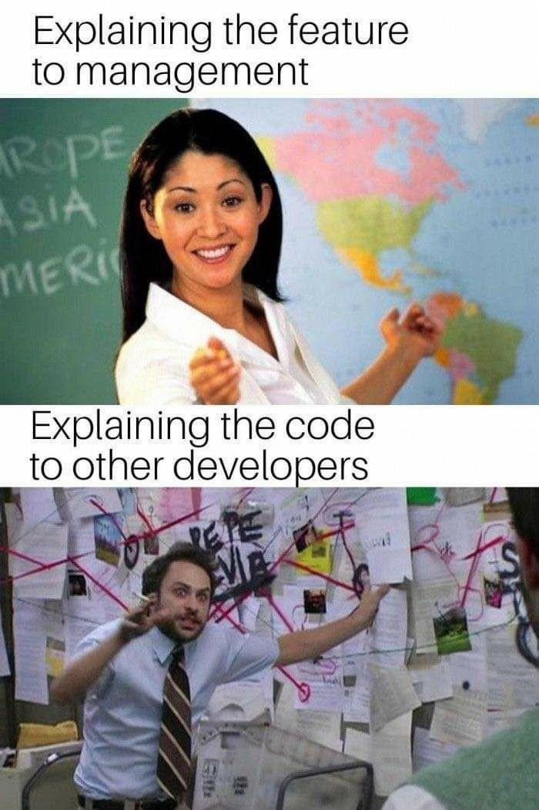
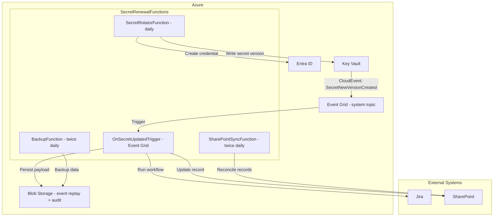

# The target design

Turn incidents into a **proactive, event-driven** workflow.

### Key components
- **Entra ID + Key Vault**: system of record for secrets
- **Event Grid system topics**: CloudEvents on secret changes
- **Azure Functions**: serverless workflow + integrations
- **Jira + SharePoint**: ticketing and tracking
- **Blob Storage**: immutable event replay and backups

**"I'm wicked smart, and with AI I'll be done in 5 minutes"**

---
layout: two-cols

---

# More problems
- What about resiliency
- What about division of responsibilities and least privilege?
- What about monitoring, alerting, and auditing?
- What about backups and replay for recovery and compliance?
- What about...?

::right::

  

---
layout: center

---

# Full architecture: close the loop

---
layout: two-cols

---

# Business value: estimated monthly hours saved

### For 150 app registrations

- Manual model (monitoring + coordination + updates): about 35 min per app per month
- Automated model (exceptions + approvals + review): about 8 min per app per month
- Estimated saving: about 27 min per app per month

### Monthly impact

- 150 x 27 min = 4,050 min per month
- About 67.5 hours saved every month
- At 200 apps, about 90 hours saved per month

::right::

# Why this matters across teams

- Fewer cross-team status pings and handoffs
- Less waiting between Wuerth teams and client teams
- Faster renewals with a shared system of record (Jira + SharePoint)
- Time shifts from firefighting to hardening and onboarding

Estimate based on... ai

I just made it up, since sometimes it was 4 days of actual work per month, sometimes just 2 hours

Please don't tell everyone that I pulled these numbers out of thin air 🙈

