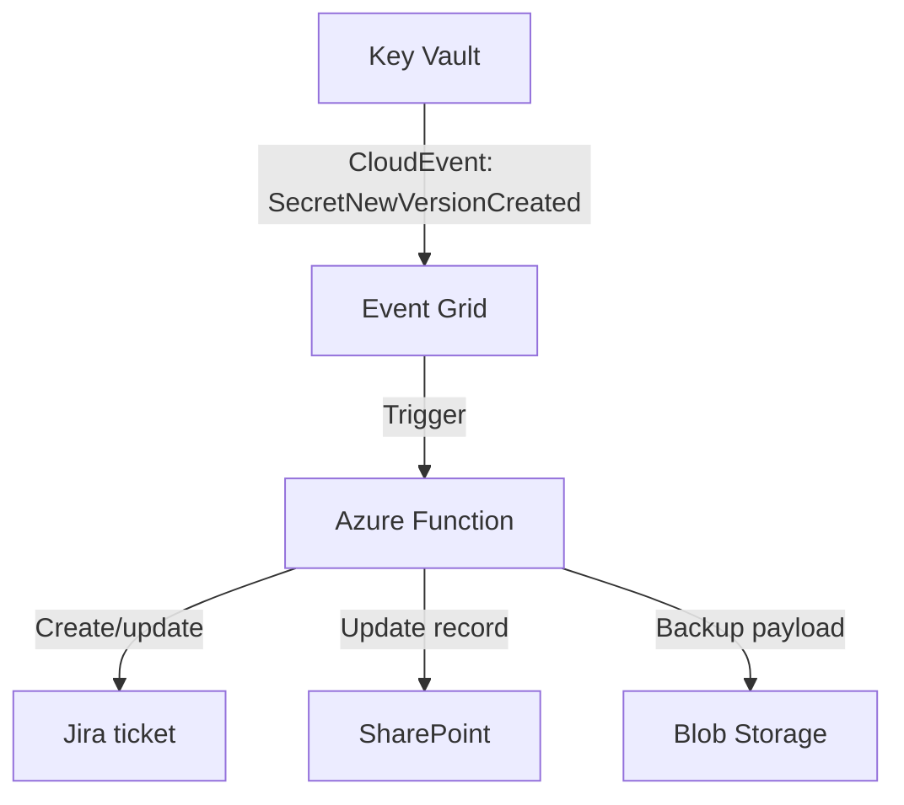
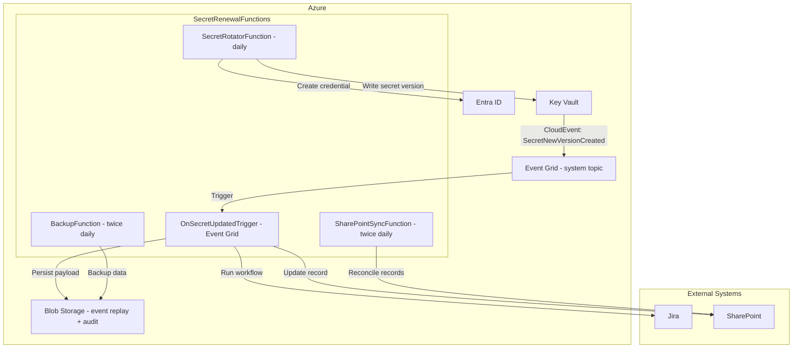

# The target design

Turn incidents into a **proactive, event-driven** workflow.

### Key components
- **Entra ID + Key Vault**: system of record for secrets
- **Event Grid system topics**: CloudEvents on secret changes
- **Azure Functions**: serverless workflow + integrations
- **Jira + SharePoint**: ticketing and tracking
- **Blob Storage**: immutable event replay and backups

**"I'm wicked smart, and with AI I'll be done in 5 minutes"**

---
layout: two-cols

---

# More problems
- What about resiliency
- What about division of responsibilities and least privilege?
- What about monitoring, alerting, and auditing?
- What about backups and replay for recovery and compliance?
- What about...?

::right::

  

---
layout: center

---

# Full architecture: close the loop

---
layout: two-cols

---

# Business value

| Model | Time/app/month |
|---|---|
| Manual | ~35 min |
| Automated | ~8 min |

**150 apps → ~67.5 hours saved/month**

::right::

# Why it matters

- Less cross-team coordination and handoffs
- Shared system of record (Jira + SharePoint)
- Time shifts from firefighting to development

(numbers are based on VIBES — trust the trend, not the math 🙈)

