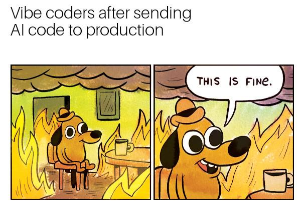

# Who observes the observer?

Every function, workflow, and integration reports to **Application Insights** — so nothing fails silently.

### Structured logging

- All functions use `ILogger<T>` wired to Application Insights via the SDK
- Correlation IDs propagate through Event Grid → Function chains
- Tracing... just works?

### Automatic alerting

- Simple detection: exceptions > 0 = email with critical alert to team...
- ...30 days to fix though

::right::

  

---
layout: two-cols
transition: slide-left
---

# Takeaways

- ✅ **Zero downtime**: proactive secret rotation
- 🔒 **Security-first operations**: no secrets shared manually outside secure channels
- ⚡ **Serverless integration**: low ops overhead, scalable by default
- 🧾 **Auditable by design**: event payloads and backups for replay
- 🧘 **Less toil**: fewer late-night surprises from expiry-driven outages

::right::

  

---
layout: two-cols
---

# Future improvements

- Add self-service dashboards for teams and clients with explainable status
- Auto-generate owner-facing summaries and action checklists per app, possibly using AI (clustering)
- Self-service secret rotation trigger for teams and clients, with explainable status and audit trails
- Self-service app registration creation or onboarding for existing apps
- More tests
- Whatever you suggest in the Q&A!

::right::

  

