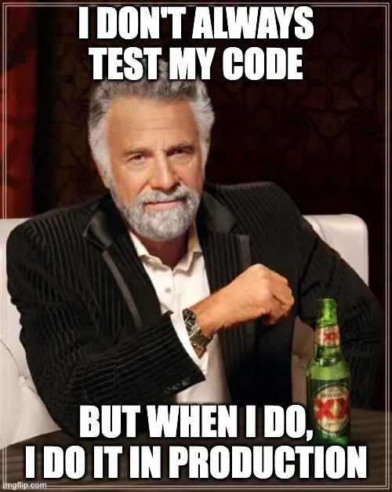

# Takeaways

- ✅ **Zero downtime**: proactive secret rotation
- 🔒 **Security-first operations**: no secret sharing out-of-band
- ⚡ **Serverless integration**: low ops overhead, scalable by default
- 🧾 **Auditable by design**: event payloads and backups for replay
- 🧘 **Less toil**: fewer late-night surprises from expiry-driven outages

  <h2 class="text-4xl font-bold text-blue-500">Continuous Innovation = Reliable Ops</h2>

---
layout: two-cols
---

# Future improvements

- Add self-service dashboards for teams and clients with explainable status
- Auto-generate owner-facing summaries and action checklists per app, possibly using AI (clustering)
- Expand policy-as-code checks before deployment and before rotation
- Improve app reg provisioning and deprovisioning workflows
- Self-service secret rotation trigger for teams and clients, with explainable status and audit trails
- Self-service app registration creation or onboarding for existing apps
- More tests???

::right::

  

